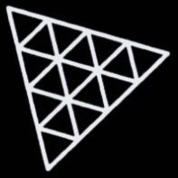
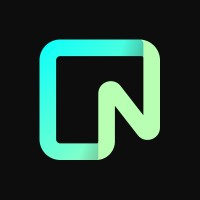

Hi 👋, I'm Giorgi Kavtaradze

FullStack Developer

🚀 About Me:
- 🏗 I’m Full-Stack Developer
- 🏗 All of my projects are available at **[My Portfolio](https://your-portfolio.com)**  
- 💬 Ask me about **React, Next, Node, Nest**  
- 📬 How to reach me **giorgikavtaradze@gmail.com**

 
### 🛠 Languages and Tools:

  
  
  
  
  
  
  
  
  
  
  
  
  
  
  
  
  
  
  

