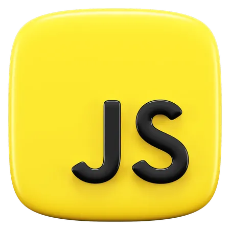
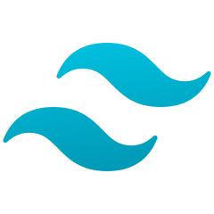
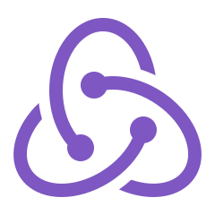
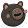
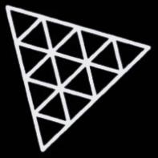
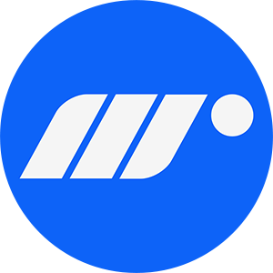
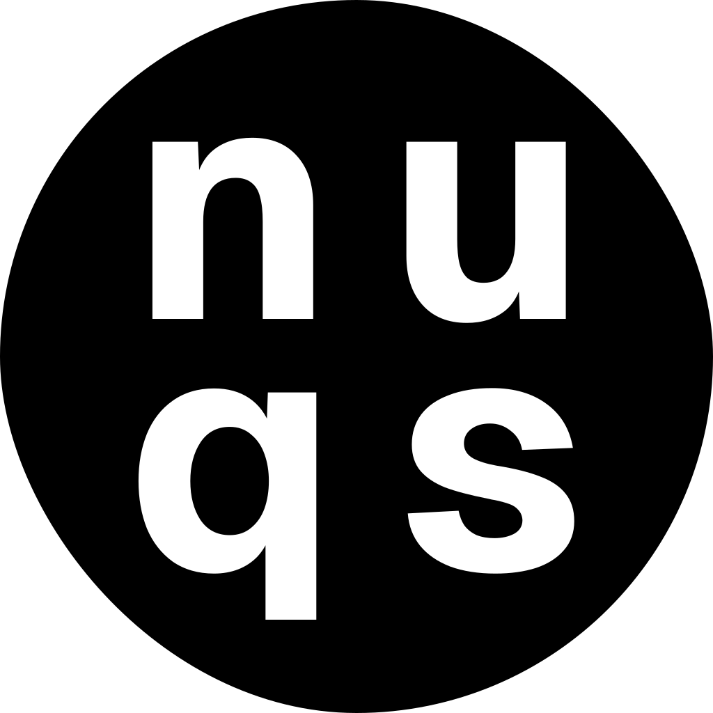
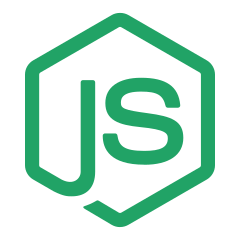
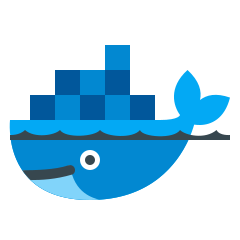

Hi 👋, I'm Giorgi Kavtaradze

FullStack Developer

🚀 About Me:
- 🏗 I’m Full-Stack Developer
- 🏗 All of my projects are available at **[My Portfolio](https://your-portfolio.com)**  
- 💬 Ask me about **React.js, React Native, Next.js, Node, Nest**  
- 📬 How to reach me **giorgi.kavtaradze2000@mail.ru**

 
### 🛠 Languages and Tools:

  
  
  
  
  
  
  
  
  
  
  
  
  
  
  
  
  
  
  
  
  

